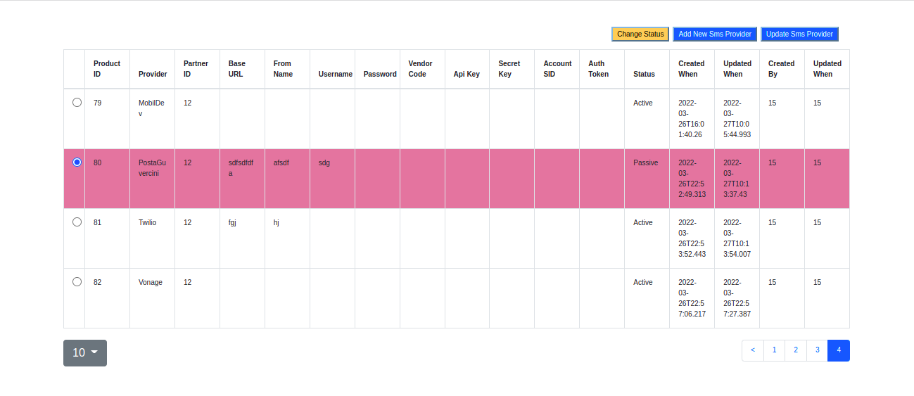
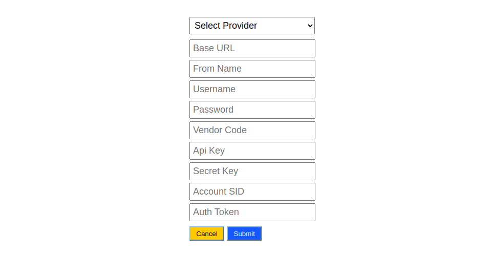
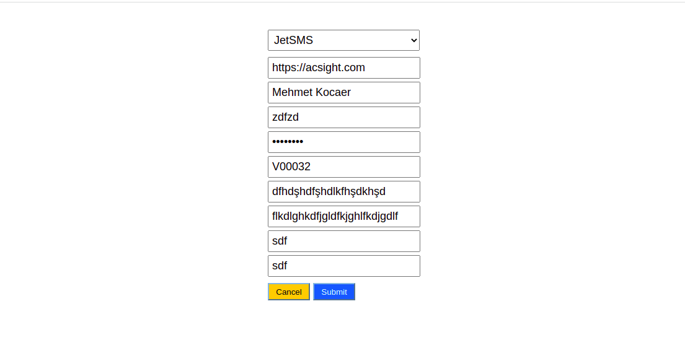

# sms-provider

## Sms Providers are listed in the table, you can add new sms provider or update existing one.





 <br/>

## In order to run this project in your local environment

 <br/>


```bash
git clone https://github.com/elifdiril/sms-provider.git
```

And then

```bash
npm install
```

to install all the dependencies. You need PartnerId, Username and password for request to api.

After started to server side:

```bash
npm start
```

to start the client side.
